🚀 GangAI Semi-Local AI Ecosystem – Next-Gen Agentic Infrastructure

Our Mission Statement:
  GangAI is building the world’s first semi-local, agentic-ready AI ecosystem that merges real-time LLMs, universal tool orchestration, and ultra-low-latency TTS into a single modular framework.What works with everything.Plug and play.
  Designed for flexibility, efficiency, and offline-first operation (OPTIONAL), GangAI reduces operational costs by 90%+ while enabling true next-generation AI applications — from personal assistants to financial trading agents to multi-agent orchestration platforms.

Our vision: replace fragmented AI frameworks with a universal, composable ecosystem all in one :) 

1. System Architecture & Modularity

  GangAI integrates four primary subsystems:
  
  Frontend / UI
  GangAI-Labs UI or any OpenAI-compatible client (e.g., OpenWebUI).
  Minimal setup, full multi-session chat interface.
  Streams both text and audio with real-time tool visualization.
  LLM Orchestrator Server
  Runs semi-local inference with models like GPT-5, GPT-4, Meta-LLaMA 3.1, or OSS-120B.
  Async, streaming, and context-aware orchestration.
  Smart session handling + Redis/MongoDB persistence.
  Cost reduction: offload 90% of queries to local models; fallback to premium APIs.
  MCP Tool Server (Model Context Protocol)
  JSON-RPC 2.0 + REST API compliant.

Supports:

  Local Python tools (@mcp_tool)
  JSON/OpenAI/OpenAPI tools
  Remote HTTP APIs
  Generator/Streaming tools (SSE)

Features:

  Hot reload, auto-discovery
  Add/remove tools dynamically
  Validation via Pydantic
  Universal Tool Layer: works across OpenAI, OpenAPI, custom APIs.

TTS Server (Amelia)

  Real-time voice cloning from 5s sample.
  0.2ms latency streaming for conversational speed.
  Multi-voice and dynamic parameterization.
  Fully local execution — privacy-first.

2. Interaction Pipeline
2.1 Standard Chat / Query

User sends a message via UI.

  LLM Orchestrator processes context.
  May generate direct response.
  May request tools via MCP Server.
  May forward response to TTS.
  Streaming responses returned to UI (text + audio in parallel).
  
  2.2 Tool / Agentic Call Flow
  
  LLM detects tool call in natural conversation.
  Request sent to MCP Server (JSON-RPC or REST).
  MCP routes execution:
    Local Python function
    Remote HTTP API
    Streaming generator tool
    Tool executes, results streamed back to LLM.
    LLM integrates tool results into context → streamed to UI → optional TTS playback.

2.3 Streaming / Generator Tools

  Handles multi-step tasks (countdowns, progress reports, analytics pipelines).
  Uses SSE for continuous updates.
  UI can show progress bars, charts, or real-time metrics.

3. Technology Stack
  Layer	Core Technologies
  Frontend / UI	React, Vite, TailwindCSS, WebSockets, SSE
  LLM Orchestrator	Python, FastAPI, asyncio, Redis, MongoDB, GPT-5 / LLaMA 3.1
  MCP Tool Server	Python, FastAPI, JSON-RPC 2.0, Pydantic, SSE
  TTS Engine	Amelia (custom), local GPU only .

---- flow charts examples ---

#easy:

# Easy Diagram


#medium:

# Medium Diagram

```mermaid
flowchart TD
    subgraph "User Interaction Layer (User is God! :D)"
        UI["Frontend / SPA (React) - Real-Time Dashboard (Agent Progress, Achievements)"]
    end

    subgraph "gangAi Core Server (The Brain!)"
        VS_IO["Vector Store (RAG/Memory) - Context & Learning"]
        LLM_ORCH["LLM Orchestrator (Local Model: Decision Maker, Queue Manager, Priority Queue)"]
        MCP["MCP Server (Universal Tool Executor - Non-Blocking)"]
    end

    subgraph "Tools & Execution Layer"
        TOOLS["Tools / APIs (e.g., business_search(), risk_assess())"]
    end

    subgraph "Premium Features (Cha-Ching!)"
        TTS["TTS Server (Amelia) - Premium Audio Streaming"]
    end

    subgraph "Agentic System (Scalable: 1000+ Agents with Hierarchy)"
        AGENTIC["Agentic Planner (Supervises, Plans, Reports to UI)"]
        QUEUE["Task Queue (Smart Routing, Priority Handling)"]
        subgraph "Mid-Level Coordinators"
            COORD_RESEARCH["Research Coordinator: Oversees Data Gathering"]
            COORD_DECIDE["Decision Coordinator: Oversees Evaluation"]
            COORD_COMPILE["Compilation Coordinator: Oversees Aggregation"]
        end
        subgraph "Low-Level Executors"
            EXEC_RESEARCH["Executor Agents: Market Analysis, Data Scraping"]
            EXEC_DECIDE["Executor Agents: Needs Evaluation, Offer Customization"]
            EXEC_COMPILE["Executor Agents: Insights Aggregation"]
        end
    end

    UI -->|"Deep Query (e.g., Businesses struggling in Vilnius? Offer loans/stake)"| LLM_ORCH
    VS_IO -->|"Context Output (RAG)"| LLM_ORCH
    LLM_ORCH -->|"Delegate Deep Dive"| AGENTIC
    AGENTIC -->|"Plan & Delegate Tasks"| QUEUE
    QUEUE -->|"Route to Coordinators"| COORD_RESEARCH
    QUEUE -->|"Route to Coordinators"| COORD_DECIDE
    QUEUE -->|"Route to Coordinators"| COORD_COMPILE
    COORD_RESEARCH -->|"Coordinate + Stream Progress"| EXEC_RESEARCH
    COORD_DECIDE -->|"Coordinate + Stream Achievements"| EXEC_DECIDE
    COORD_COMPILE -->|"Coordinate + Stream Milestones"| EXEC_COMPILE
    EXEC_RESEARCH -->|"Execute + Report to UI (e.g., Gathered Profiles)"| TOOLS
    EXEC_DECIDE -->|"Execute + Report to UI (e.g., Assessed Risks)"| TOOLS
    EXEC_COMPILE -->|"Execute + Report to UI (e.g., Compiled Insights)"| TOOLS
    EXEC_RESEARCH -->|"Raw Data"| COORD_RESEARCH
    COORD_RESEARCH -->|"Aggregated Research"| COORD_DECIDE
    COORD_DECIDE -->|"Custom Decisions (e.g., Loan Terms)"| COORD_COMPILE
    COORD_COMPILE -->|"Final Report"| AGENTIC
    AGENTIC -->|"Compiled Decision + UI Update"| LLM_ORCH
    LLM_ORCH -->|"Polished Response + UX Stream (e.g., 🤔 Analyzing Vilnius Businesses)"| UI
    LLM_ORCH -.->|"Optional Premium"| TTS
    TTS -->|"Audio Stream"| UI
    UI -.->|"Feedback Loop"| VS_IO
    LLM_ORCH -->|"Memory Update"| VS_IO
    AGENTIC -.->|"Deep Dive Logs"| VS_IO
    UI -->|"Interrupt/Step-In/Rollback (God-Mode)"| AGENTIC

    classDef investorStyle fill:#e1f5fe,stroke:#01579b,stroke-width:2px,color:#000;
    classDef agentStyle fill:#f3e5f5,stroke:#4a148c,stroke-width:2px,color:#000;
    classDef premiumStyle fill:#fff3e0,stroke:#e65100,stroke-width:2px,color:#000;
    classDef midStyle fill:#e8f5e8,stroke:#2e7d32,stroke-width:2px,color:#000;
    classDef lowStyle fill:#fffde7,stroke:#f57f17,stroke-width:2px,color:#000;
    class UI,VS_IO,LLM_ORCH,MCP investorStyle;
    class AGENTIC,QUEUE agentStyle;
    class TTS premiumStyle;
    class TOOLS default;
    class COORD_RESEARCH,COORD_DECIDE,COORD_COMPILE midStyle;
    class EXEC_RESEARCH,EXEC_DECIDE,EXEC_COMPILE lowStyle;
```


#hard:
```mermaid
flowchart TD
    subgraph "User Interaction Layer (User is God! :D)"
        UI["Frontend / SPA (React) - Real-Time Dashboard (Agent Progress, Achievements, Simulation Results)"]
    end

    subgraph "gangAi Core Server (The Brain!)"
        VS_IO["Vector Store (RAG/Memory) - Context, Learning, Simulation Data"]
        LLM_ORCH["LLM Orchestrator (Local Model: Decision Maker, Queue Manager, Priority Queue, Rollback Engine)"]
        MCP["MCP Server (Universal Tool Executor - Non-Blocking, Interruptible)"]
    end

    subgraph "Tools & Execution Layer"
        TOOLS["Tools / APIs (e.g., business_search(), simulation_engine())"]
    end

    subgraph "Premium Features (Cha-Ching!)"
        TTS["TTS Server (Amelia) - Premium Audio Streaming"]
    end

    subgraph "Agentic System (Scalable: 1000+ Agents with Hierarchy)"
        AGENTIC["Agentic Planner (Supervises, Plans Simulations, Reports to UI)"]
        QUEUE["Task Queue (Smart Routing, High-Priority Simulation Tasks)"]
        subgraph "Mid-Level Coordinators"
            COORD_RESEARCH["Research Coordinator: Oversees Data & Simulation Scenarios"]
            COORD_DECIDE["Decision Coordinator: Oversees Offer Optimization"]
            COORD_COMPILE["Compilation Coordinator: Oversees Prediction Aggregation"]
        end
        subgraph "Low-Level Executors"
            EXEC_RESEARCH["Executor Agents: Market Analysis, Scenario Simulation"]
            EXEC_DECIDE["Executor Agents: Offer Optimization, Risk Modeling"]
            EXEC_COMPILE["Executor Agents: Aggregate Predictions, Final Reports"]
        end
    end

    %% Hard Case Flow
    UI -->|"Complex Query (e.g., Simulate global business impacts, optimize offers?)"| gangAi_Core_Server
    VS_IO -->|"Context Output (RAG)"| LLM_ORCH
    LLM_ORCH -->|"Delegate Simulation Tasks"| AGENTIC
    AGENTIC -->|"Plan & Spin Simulation Layers"| QUEUE
    QUEUE -->|"High-Priority Routing"| COORD_RESEARCH
    QUEUE -->|"High-Priority Routing"| COORD_DECIDE
    QUEUE -->|"High-Priority Routing"| COORD_COMPILE
    COORD_RESEARCH -->|"Simulate Scenarios + Stream Progress"| EXEC_RESEARCH
    COORD_DECIDE -->|"Optimize Offers + Stream Updates"| EXEC_DECIDE
    COORD_COMPILE -->|"Aggregate Predictions + Stream Milestones"| EXEC_COMPILE
    EXEC_RESEARCH -->|"Execute + Report to UI (e.g., Simulated Trends)"| TOOLS
    EXEC_DECIDE -->|"Execute + Report to UI (e.g., Optimized Offers)"| TOOLS
    EXEC_COMPILE -->|"Execute + Report to UI (e.g., Predicted Outcomes)"| TOOLS
    EXEC_RESEARCH -->|"Scenario Data"| COORD_RESEARCH
    COORD_RESEARCH -->|"Simulated Results"| COORD_DECIDE
    COORD_DECIDE -->|"Optimized Offers"| COORD_COMPILE
    COORD_COMPILE -->|"Final Predictions"| AGENTIC
    AGENTIC -->|"Compiled Strategy + UI Update"| LLM_ORCH
    LLM_ORCH -->|"Polished Response + UX Stream (e.g., 🤔 Simulating Global Impacts)"| UI
    LLM_ORCH -.->|"Optional Premium"| TTS
    TTS -->|"Audio Stream"| UI
    UI -.->|"Feedback Loop"| VS_IO
    LLM_ORCH -->|"Memory Update"| VS_IO
    AGENTIC -.->|"Simulation Logs"| VS_IO
    UI -->|"Interrupt/Step-In/Rollback (God-Mode)"| AGENTIC
    UI -->|"Interrupt/Step-In/Rollback (God-Mode)"| QUEUE

    %% Styling
    classDef investorStyle fill:#e1f5fe,stroke:#01579b,stroke-width:2px,color:#000;
    classDef agentStyle fill:#f3e5f5,stroke:#4a148c,stroke-width:2px,color:#000;
    classDef premiumStyle fill:#fff3e0,stroke:#e65100,stroke-width:2px,color:#000;
    classDef midStyle fill:#e8f5e8,stroke:#2e7d32,stroke-width:2px,color:#000;
    classDef lowStyle fill:#fffde7,stroke:#f57f17,stroke-width:2px,color:#000;
    class UI,VS_IO,LLM_ORCH,MCP investorStyle;
    class AGENTIC,QUEUE agentStyle;
    class TTS premiumStyle;
    class TOOLS default;
    class COORD_RESEARCH,COORD_DECIDE,COORD_COMPILE midStyle;
    class EXEC_RESEARCH,EXEC_DECIDE,EXEC_COMPILE lowStyle;
 ```

#expert:
```mermaid
flowchart TD
    subgraph "User Interaction Layer (User is God! :D)"
        UI["Frontend / SPA (React) - Real-Time Dashboard (Agent Progress, Achievements, What-If Scenarios, Iteration Controls)"]
    end

    subgraph "gangAi Core Server (The Brain!)"
        VS_IO["Vector Store (RAG/Memory) - Context, Learning, Simulation & Rollback Data"]
        LLM_ORCH["LLM Orchestrator (Local Model: Decision Maker, Queue Manager, Priority Queue, Rollback Engine, Iteration Handler)"]
        MCP["MCP Server (Universal Tool Executor - Non-Blocking, Interruptible, Resilient)"]
    end

    subgraph "Tools & Execution Layer"
        TOOLS["Tools / APIs (e.g., simulation_engine(), predictive_model(), what_if_analyzer())"]
    end

    subgraph "Premium Features (Cha-Ching!)"
        TTS["TTS Server (Amelia) - Premium Audio Streaming"]
    end

    subgraph "Agentic System (Scalable: 1000+ Agents with Hierarchy & User Iterations)"
        AGENTIC["Agentic Planner (Supervises, Plans Iterations, Streams What-If Results to UI)"]
        QUEUE["Task Queue (Smart Routing, Ultra-High Priority, Rollback & Iteration Support)"]
        subgraph "Mid-Level Coordinators"
            COORD_RESEARCH["Research Coordinator: Oversees Predictive Data & Scenarios"]
            COORD_DECIDE["Decision Coordinator: Oversees Strategy Optimization"]
            COORD_COMPILE["Compilation Coordinator: Oversees Scenario Integration"]
        end
        subgraph "Low-Level Executors"
            EXEC_RESEARCH["Executor Agents: Predictive Modeling, What-If Scenarios"]
            EXEC_DECIDE["Executor Agents: Strategy Optimization, Risk Prediction"]
            EXEC_COMPILE["Executor Agents: Final Predictions, Iteration Synthesis"]
        end
    end

    %% Expert Case Flow
    UI -->|"Ultra-Complex Query (e.g., Optimize global strategy with what-if scenarios?)"| gangAi_Core_Server
    VS_IO -->|"Context Output (RAG)"| LLM_ORCH
    LLM_ORCH -->|"Delegate Predictive Tasks + Iterations"| AGENTIC
    AGENTIC -->|"Plan & Spin What-If Layers"| QUEUE
    QUEUE -->|"Ultra-High Priority Routing"| COORD_RESEARCH
    QUEUE -->|"Ultra-High Priority Routing"| COORD_DECIDE
    QUEUE -->|"Ultra-High Priority Routing"| COORD_COMPILE
    COORD_RESEARCH -->|"Run Scenarios + Stream Progress to UI"| EXEC_RESEARCH
    COORD_DECIDE -->|"Optimize Strategies + Stream Updates to UI"| EXEC_DECIDE
    COORD_COMPILE -->|"Synthesize Iterations + Stream Milestones to UI"| EXEC_COMPILE
    EXEC_RESEARCH -->|"Execute + Report to UI (e.g., Modeled Scenarios)"| TOOLS
    EXEC_DECIDE -->|"Execute + Report to UI (e.g., Optimized Strategies)"| TOOLS
    EXEC_COMPILE -->|"Execute + Report to UI (e.g., Predicted Outcomes)"| TOOLS
    EXEC_RESEARCH -->|"Predictive Data"| COORD_RESEARCH
    COORD_RESEARCH -->|"Scenario Results"| COORD_DECIDE
    COORD_DECIDE -->|"Optimized Strategies"| COORD_COMPILE
    COORD_COMPILE -->|"Final Predictions + Iteration Report"| AGENTIC
    AGENTIC -->|"Iterated Strategy + Comprehensive UI Update"| LLM_ORCH
    LLM_ORCH -->|"Polished Response + UX Stream (e.g., 🤔 Optimizing Global Strategy)"| UI
    LLM_ORCH -.->|"Optional Premium"| TTS
    TTS -->|"Audio Stream"| UI
    UI -.->|"Feedback Loop (Iterate/Rollback)"| VS_IO
    LLM_ORCH -->|"Memory Update (Real-Time)"| VS_IO
    AGENTIC -.->|"Iteration & Prediction Logs"| VS_IO
    UI -->|"Interrupt/Step-In/Rollback/Iterate (God-Mode)"| AGENTIC
    UI -->|"Interrupt/Step-In/Rollback/Iterate (God-Mode)"| QUEUE
    UI -->|"Iterative Feedback (Refine Scenarios)"| LLM_ORCH

    %% Styling
    classDef investorStyle fill:#e1f5fe,stroke:#01579b,stroke-width:2px,color:#000;
    classDef agentStyle fill:#f3e5f5,stroke:#4a148c,stroke-width:2px,color:#000;
    classDef premiumStyle fill:#fff3e0,stroke:#e65100,stroke-width:2px,color:#000;
    classDef midStyle fill:#e8f5e8,stroke:#2e7d32,stroke-width:2px,color:#000;
    classDef lowStyle fill:#fffde7,stroke:#f57f17,stroke-width:2px,color:#000;
    class UI,VS_IO,LLM_ORCH,MCP investorStyle;
    class AGENTIC,QUEUE agentStyle;
    class TTS premiumStyle;
    class TOOLS default;
    class COORD_RESEARCH,COORD_DECIDE,COORD_COMPILE midStyle;
    class EXEC_RESEARCH,EXEC_DECIDE,EXEC_COMPILE lowStyle;
```

Please note all is under dev :) 

 
